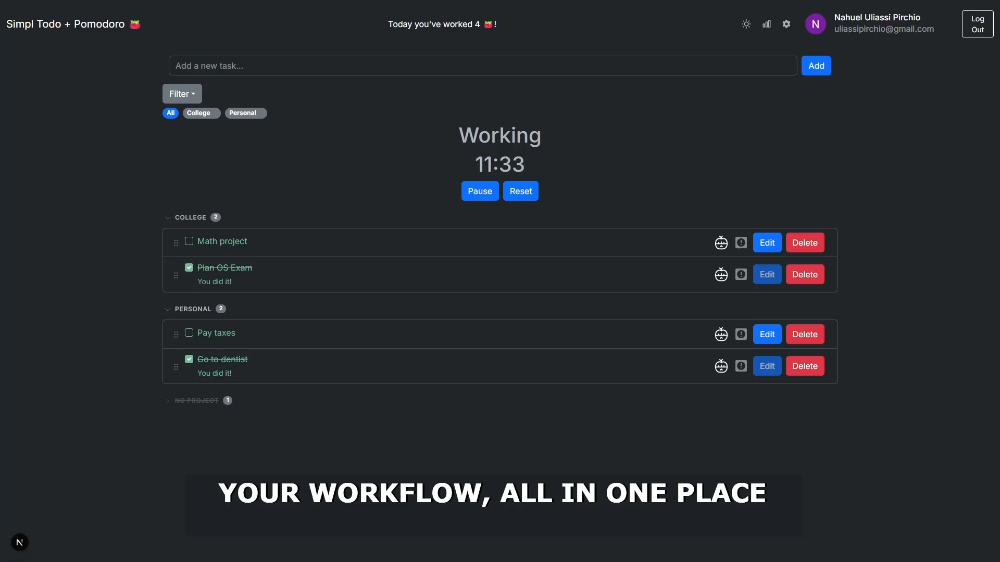
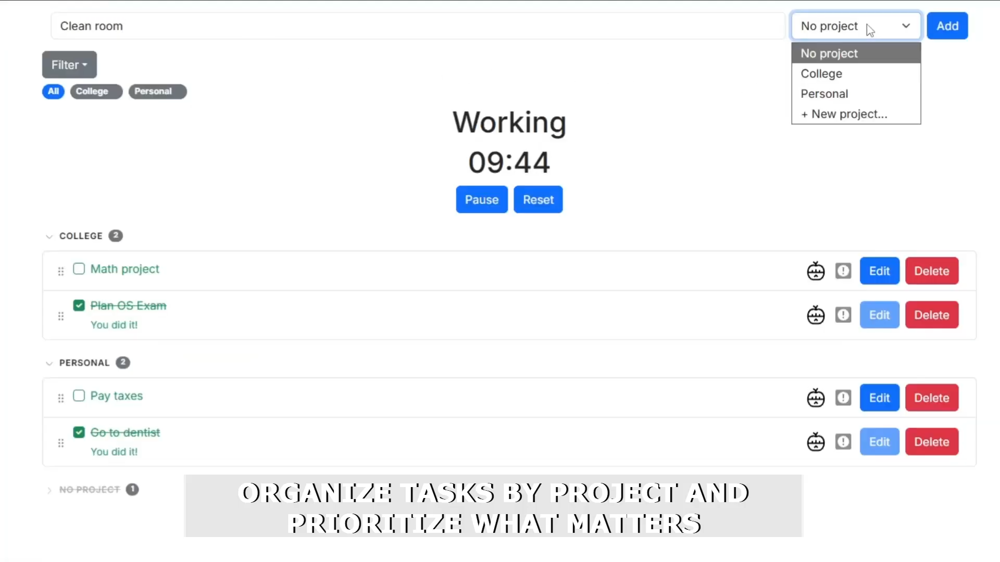
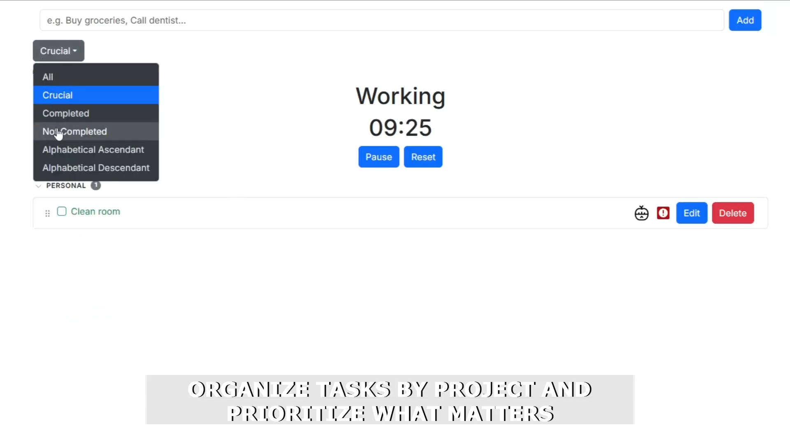
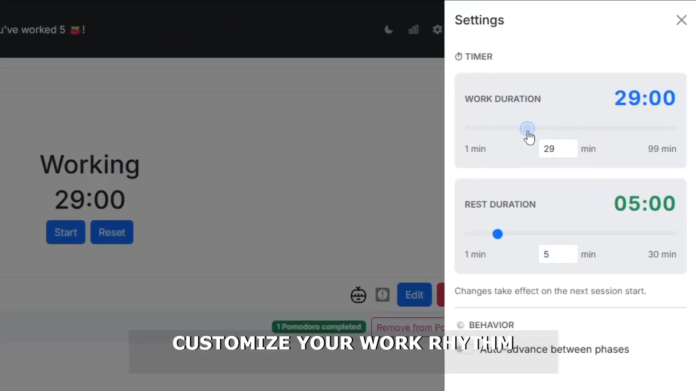
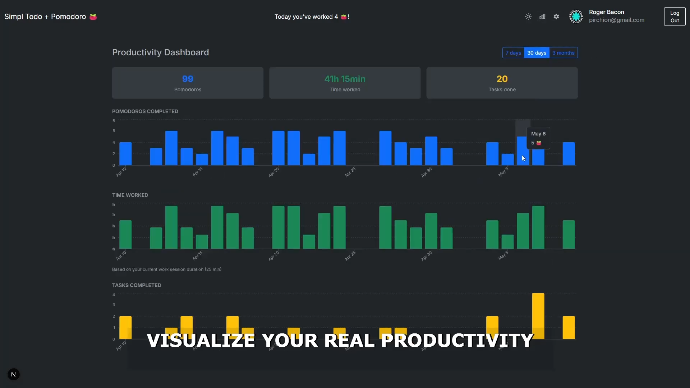
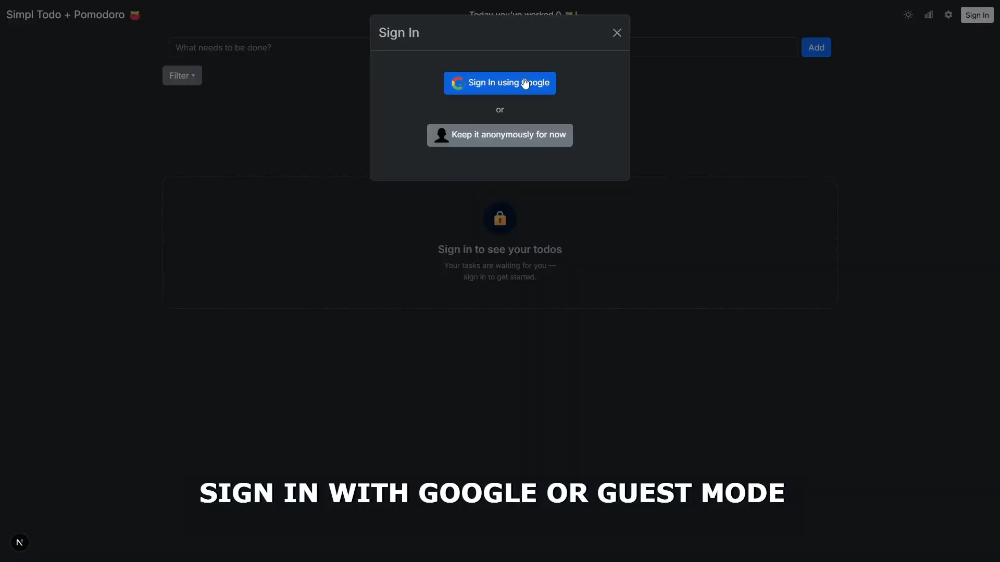

# Simple Pomodoro Todo

> A focused productivity app that combines a Pomodoro timer with task management, project organization, and cloud sync.

## 🌐 Live Demo

[simple-pomodoro-todo-up.vercel.app](https://simple-pomodoro-todo-up.vercel.app/)

---

## 📖 About

Simple Pomodoro Todo is a web app designed to help you stay focused and organized using the Pomodoro Technique. You can manage tasks, group them by project, run timed focus sessions linked to specific to-dos, and track your productivity over time through a stats dashboard. Everything syncs in real time via Firebase, so your data is available across devices.

## ✨ Features

- **Pomodoro timer** — configurable work, short break, and long break durations
- **Task management** — create, complete, delete, and drag-and-drop reorder todos
- **Project grouping** — organize tasks into projects with an accordion view and per-project CRUD
- **Multi-select filtering** — filter your task list by one or more projects simultaneously
- **Productivity stats** — historical charts showing completed pomodoros and tasks over time
- **Cloud sync** — real-time persistence with Firestore; data available across all your devices
- **Authentication** — sign in with Google via Firebase Auth
- **Theme support** — light and dark mode

---

## 🛠 Tech Stack

| Category | Technology |
|----------|-----------|
| Framework | Next.js 16 |
| UI Library | React 18 |
| Language | JavaScript (JSX) |
| Styling | Bootstrap 5, React-Bootstrap, CSS Modules |
| State | Zustand |
| Charts | Recharts |
| Drag & Drop | @dnd-kit |
| Backend / DB | Firebase (Firestore) |
| Auth | Firebase Authentication |
| Deployment | Vercel |

---

## 🚀 Getting Started

### Prerequisites

- Node.js 20 or higher
- A Firebase project with Firestore and Authentication enabled

### Installation

```bash
git clone https://github.com/NahuelUliassiPirchio/simple-pomodoro-todo.git
cd simple-pomodoro-todo
npm install
```

Create a `.env.local` file at the project root and add your Firebase credentials:

```bash
NEXT_PUBLIC_FIRESTORE_API_KEY=...
NEXT_PUBLIC_FIRESTORE_AUTH_DOMAIN=...
NEXT_PUBLIC_FIRESTORE_PROJECT_ID=...
NEXT_PUBLIC_FIRESTORE_STORAGE_BUCKET=...
NEXT_PUBLIC_FIRESTORE_MESSAGING_SENDER_ID=...
NEXT_PUBLIC_FIRESTORE_APP_ID=...
NEXT_PUBLIC_FIRESTORE_MEASUREMENT_ID=...
```

---

## 📁 Project Structure

```
src/
├── app/               # Next.js App Router — pages and layouts
│   └── stats/         # Productivity stats route
├── components/        # UI components (timer, todo list, charts, modals…)
├── contexts/          # React context providers (AuthContext)
├── firebase/          # Firebase config and initialization
├── hooks/             # Custom hooks (timer, todos, projects, dashboard data)
├── services/          # Auth and Firestore service layer
├── stores/            # Zustand global store
└── utils/             # Formatters, filters, error boundary
```

---

## 🖥 Usage

**Development**
```bash
npm run dev
```

**Production build**
```bash
npm run build
npm run start
```

---

## 📸 Screenshots

**Main view — timer running with tasks grouped by project**


**Creating a task and assigning it to a project**


**Task filtering and sorting options**


**Customizable work and rest durations**


**Productivity dashboard with historical charts**


**Sign in with Google or continue as guest**


---

## 👤 Author

**Nahuel Uliassi Pirchio**

- 🌐 [uliassipirchio.com](https://uliassipirchio.com)
- 💼 [LinkedIn](https://linkedin.com/in/uliassipirchio)
- 🐙 [GitHub](https://github.com/NahuelUliassiPirchio)
- 🗂 [Project on portfolio](https://www.uliassipirchio.com/projects/simple-pomodoro-todo)
